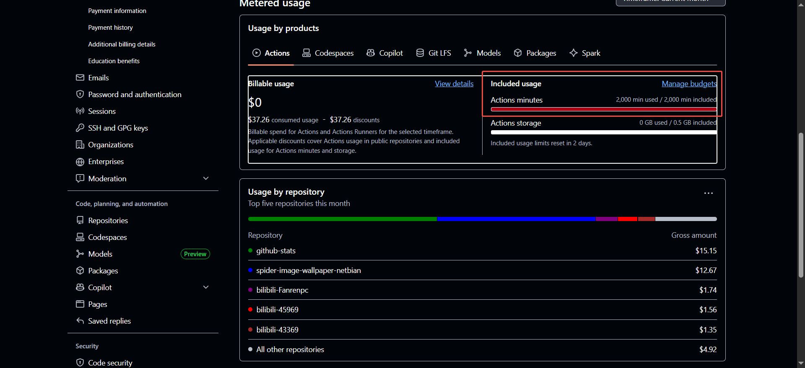

[TOC]

---

# github-actions-test

 [](https://github.com/yansheng836/github-actions-test/issues) [](https://github.com/yansheng836/github-actions-test/pulls) [](https://github.com/yansheng836/github-actions-test/tags) [](https://github.com/yansheng836/github-actions-test/releases)   [](https://app.codacy.com/gh/yansheng836/github-actions-test/dashboard?utm_source=gh&utm_medium=referral&utm_content=&utm_campaign=Badge_grade) [](https://github.com/yansheng836/github-actions-test/blob/main/LICENSE.txt)

---


测试GitHub Actions的功能。

## 测试功能分类

### 常见开发语言

- [x] Python项目  
- [ ] Java项目
- [ ] GO项目
- [ ] C语言项目
- [ ] C++语言项目
- [ ] shell项目
- [ ] Windows环境项目
- [ ] 其他

### GitHub常用功能

- [ ] GitHub Actions基本模块。
- [x] 依赖管理 dependabot.yml （文件名好像需要是固定的！）
- [x] github遇到tag自动release，并打包文件。 
- [ ] 处理有子模块（.gitmodules）的情况。
- [ ] 并发处理，同一个任务同时运行时，如何进行处理，参考：<https://github.com/yansheng836/spider-image-wallpaper-netbian>
- [ ] 使用github action，发现ubuntu主机磁盘是80g的，但是只有15g是可用的，其他都被系统资源占用了，是否有办法扩大磁盘空间？或者使用轻量化的UBuntu主机？，参考：<https://yuanbao.tencent.com/chat/naQivTmsDa/0a83abb6-08a4-4fdc-8778-5a4cb38287cf>，具体工具：<https://github.com/marketplace/actions/maximize-github-runner-space>。参考配置如下：
  ```yml
  jobs:
    build:
      runs-on: ubuntu-latest
      steps:
        - name: Maximize Disk Space for Python
          uses: justinthelaw/maximize-github-runner-space@master
          with:
            remove-dotnet: 'true'     # 移除.NET SDK（~10GB）
            remove-android: 'true'    # 移除Android SDK（~14GB）
            remove-docker: 'true'     # 移除Docker相关（~3GB）
            remove-snap: 'true'       # 移除Snapd（~2GB）
            remove-man-db: 'true'     # 移除man-db（~1GB）
            removefonts: 'true'       # 移除非必要字体（~500MB）
            remove-telemetry: 'true'  # 移除系统遥测工具（如snapd-telemetry）
            remove-docs: 'true'       # 移除系统网页（~3GB）
            remove-temp: 'true'       # 清理APT缓存和临时文件（~8GB）
            remove-ruby: 'true'       # 移除Ruby（~1.5GB）
            remove-nodejs: 'true'     # 移除Node.js（~3GB）
  ```

## 相关链接

### 1.官方文档

https://docs.github.com/zh/actions

### 2.官方模板仓库

https://github.com/actions/starter-workflows

ci：一些常见语言的ci

cpp：https://github.com/actions/starter-workflows/blob/main/ci/c-cpp.yml

go：https://github.com/actions/starter-workflows/blob/main/ci/go.yml

https://github.com/actions/starter-workflows/blob/main/ci/gradle.yml

https://github.com/actions/starter-workflows/blob/main/ci/maven.yml

https://github.com/actions/starter-workflows/blob/main/ci/node.js.yml

https://github.com/actions/starter-workflows/blob/main/ci/php.yml

https://github.com/actions/starter-workflows/blob/main/ci/pylint.yml

https://github.com/actions/starter-workflows/blob/main/ci/python-package.yml

包管理：https://github.com/actions/starter-workflows/blob/main/.github/dependabot.yml  

review指派：https://github.com/actions/starter-workflows/blob/main/.github/auto_assign.yml

https://github.com/actions/starter-workflows/blob/main/.github/pull_request_template.md

提交到GitHub：https://github.com/actions/starter-workflows/blob/main/.github/workflows/sync-ghes.yaml

关闭比较长时间的issue：https://github.com/actions/starter-workflows/blob/main/.github/workflows/stale.yml

## 常见报错及处理

### 1.actions没额度了

https://github.com/yansheng836/spider-image-wallpaper-netbian/actions/runs/20584065501

**Annotations**

1 error

The job was not started because recent account payments have failed or your spending limit needs to be increased. Please check the 'Billing & plans' section in your settings

https://github.com/settings/billing



公开仓库好像是不限制action使用时间的，免费个人账号的私有仓库一个月限制一共只能使用2000分钟，下个月自动刷新。


