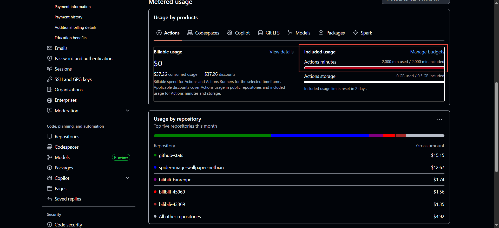

[TOC]

---

# github-actions-test

 [](https://github.com/yansheng836/github-actions-test/issues) [](https://github.com/yansheng836/github-actions-test/pulls) [](https://github.com/yansheng836/github-actions-test/tags) [](https://github.com/yansheng836/github-actions-test/releases)   [](https://app.codacy.com/gh/yansheng836/github-actions-test/dashboard?utm_source=gh&utm_medium=referral&utm_content=&utm_campaign=Badge_grade) [](https://github.com/yansheng836/github-actions-test/blob/main/LICENSE.txt)

---


测试GitHub Actions的功能。

## 测试功能分类

### 常见开发语言

- [x] Python项目  
- [ ] Java项目
- [ ] GO项目
- [ ] C语言项目
- [ ] C++语言项目
- [ ] shell项目
- [ ] Windows环境项目
- [ ] 其他

### GitHub常用功能

- [ ] GitHub Actions基本模块。
- [x] 依赖管理 dependabot.yml （文件名好像需要是固定的！）
- [x] github遇到tag自动release，并打包文件。 
- [ ] 处理有子模块（.gitmodules）的情况。
- [ ] 并发处理，同一个任务同时运行时，如何进行处理，参考：<https://github.com/yansheng836/spider-image-wallpaper-netbian>
- [ ] 使用github action，发现ubuntu主机磁盘是80g的，但是只有15g是可用的，其他都被系统资源占用了，是否有办法扩大磁盘空间？或者使用轻量化的UBuntu主机？，参考：<https://yuanbao.tencent.com/chat/naQivTmsDa/0a83abb6-08a4-4fdc-8778-5a4cb38287cf>，具体工具：<https://github.com/marketplace/actions/maximize-github-runner-space>。参考配置如下：
  ubuntu镜像：只有15GB可用
  ```shell
  Available storage:
  Filesystem      Size  Used Avail Use% Mounted on
  /dev/root        72G   57G   15G  80% /
  tmpfs           3.9G   84K  3.9G   1% /dev/shm
  tmpfs           1.6G  1.1M  1.6G   1% /run
  tmpfs           5.0M     0  5.0M   0% /run/lock
  /dev/sda16      881M   62M  758M   8% /boot
  /dev/sda15      105M  6.2M   99M   6% /boot/efi
  tmpfs           795M   12K  795M   1% /run/user/1001
  ```
  配置
  ```yml
  jobs:
    build:
      runs-on: ubuntu-latest
      steps:
        # 详见：https://github.com/marketplace/actions/maximize-github-runner-space
        - name: Maximize Runner Space
          uses: justinthelaw/maximize-github-runner-space@master
          with:
            remove-dotnet: 'true'         # Removes .NET runtime and libraries. (frees ~2 GB)
            remove-android: 'true'        # Removes Android SDKs and Tools. (frees ~9 GB)
            remove-haskell: 'true'        # Removes GHC (Haskell) artifacts. (frees ~5 GB)
            remove-codeql: 'true'         # Removes CodeQL Action Bundles. (frees ~5 GB)
            remove-docker-images: 'true'  # Removes cached Docker images. (frees ~3 GB)
            # Custom removal actions
            remove-large-packages: 'true' # Removes unwanted large Apt packages. (frees ~3 GB)
            remove-cached-tools: 'true'   # Removes cached tools used by setup actions by GitHub. (frees ~8 GB)
            remove-swapfile: 'true'       # Removes the Swapfile. (frees ~4 GB)
  ```
  处理后，有48GB可用，多出33GB。
  ```shell
  Available storage:
  Filesystem      Size  Used Avail Use% Mounted on
  /dev/root        72G   25G   48G  34% /
  tmpfs           3.9G   84K  3.9G   1% /dev/shm
  tmpfs           1.6G  1.1M  1.6G   1% /run
  tmpfs           5.0M     0  5.0M   0% /run/lock
  /dev/sda16      881M   62M  758M   8% /boot
  /dev/sda15      105M  6.2M   99M   6% /boot/efi
  tmpfs           795M   12K  795M   1% /run/user/1001
  ```
  
## 相关链接

### 1.官方文档

https://docs.github.com/zh/actions

### 2.官方模板仓库

https://github.com/actions/starter-workflows

ci：一些常见语言的ci

cpp：https://github.com/actions/starter-workflows/blob/main/ci/c-cpp.yml

go：https://github.com/actions/starter-workflows/blob/main/ci/go.yml

https://github.com/actions/starter-workflows/blob/main/ci/gradle.yml

https://github.com/actions/starter-workflows/blob/main/ci/maven.yml

https://github.com/actions/starter-workflows/blob/main/ci/node.js.yml

https://github.com/actions/starter-workflows/blob/main/ci/php.yml

https://github.com/actions/starter-workflows/blob/main/ci/pylint.yml

https://github.com/actions/starter-workflows/blob/main/ci/python-package.yml

包管理：https://github.com/actions/starter-workflows/blob/main/.github/dependabot.yml  

review指派：https://github.com/actions/starter-workflows/blob/main/.github/auto_assign.yml

https://github.com/actions/starter-workflows/blob/main/.github/pull_request_template.md

提交到GitHub：https://github.com/actions/starter-workflows/blob/main/.github/workflows/sync-ghes.yaml

关闭比较长时间的issue：https://github.com/actions/starter-workflows/blob/main/.github/workflows/stale.yml

## 常见报错及处理

### 1.actions没额度了

https://github.com/yansheng836/spider-image-wallpaper-netbian/actions/runs/20584065501

**Annotations**

1 error

The job was not started because recent account payments have failed or your spending limit needs to be increased. Please check the 'Billing & plans' section in your settings

https://github.com/settings/billing



公开仓库好像是不限制action使用时间的，免费个人账号的私有仓库一个月限制一共只能使用2000分钟，下个月自动刷新。

## 相关扩展

### 1.Maximize Runner Space

配置如下：

```yml
    # 详见：https://github.com/marketplace/actions/maximize-github-runner-space
    # https://github.com/marketplace/actions/maximize-github-runner-space
    - name: Maximize Runner Space
      uses: justinthelaw/maximize-github-runner-space@main
      with:
        # Option A: Maximum Cleanup (Default)
        cleanup-profile: max            # default
        skip-components: cached-python
        swapfile-size: 2G

        # Option B: Custom Cleanup
        # cleanup-profile: custom       # use with remove-*
        # remove-dotnet: "true"         # Removes .NET runtime and libraries. (frees ~2 GB)
        # remove-android: "true"        # Removes Android SDKs and Tools. (frees ~9 GB)
        # remove-haskell: "true"        # Removes GHC (Haskell) artifacts. (frees ~5 GB)
        # remove-codeql: "true"         # Removes CodeQL Action Bundles. (frees ~5 GB)
        # remove-docker-images: "true"  # Removes cached Docker images. (frees ~3 GB)
        # # Custom removal actions
        # remove-large-packages: "true" # Removes unwanted large Apt packages. (frees ~3 GB)
        # remove-cached-tools: "true"   # Removes cached tools used by setup actions by GitHub. (frees ~8 GB)
```

#### 效果：使用前后进行对比

默认空间：总大小之前默认好像是70G，最近（2026年3月31日）发现好像变成145G了。

这里只关注可用空间。

默认磁盘空间如下：

```shell
df -h
Filesystem      Size  Used Avail Use% Mounted on
/dev/root       145G   55G   90G  38% /
tmpfs           7.9G   84K  7.9G   1% /dev/shm
tmpfs           3.2G  1.1M  3.2G   1% /run
tmpfs           5.0M     0  5.0M   0% /run/lock
efivarfs        128M   26K  128M   1% /sys/firmware/efi/efivars
/dev/sda16      881M   64M  756M   8% /boot
/dev/sda15      105M  6.2M   99M   6% /boot/efi
tmpfs           1.6G   12K  1.6G   1% /run/user/1001
```

使用前后进行对比

|  模式  | 清理类型               | 默认可用空间(G) | 清理空间(G) | 清理后可用空间(G) | 耗时(S) |
| :----: | :--------------------- | --------------: | ----------: | ----------------: | ------: |
|   -    | 默认                   |              90 |           0 |                90 |       0 |
| 模式一 | max                    |              90 |          36 |               126 |   3m 0s |
|        |                        |                 |             |                   |         |
| 模式二 | remove-dotnet          |              90 |           5 |                95 |      9s |
| 模式二 | remove-android         |              90 |          10 |               100 |     22s |
| 模式二 | remove-haskell         |              90 |           4 |                94 |      2s |
| 模式二 | remove-codeql          |              90 |           2 |                92 |      5s |
| 模式二 | remove-docker-images   |              90 |           2 |                92 |     19s |
| 模式二 | remove-large-packages  |              90 |           5 |                95 |  1m 52s |
| 模式二 | remove-cached-tools    |              90 |           6 |                96 |     28s |
| 模式二 | 清理以上模式二所有类型 |              90 |          30 |               120 |  2m 31s |

如果不计较时间，使用模式一，能清理出更多磁盘空间。

